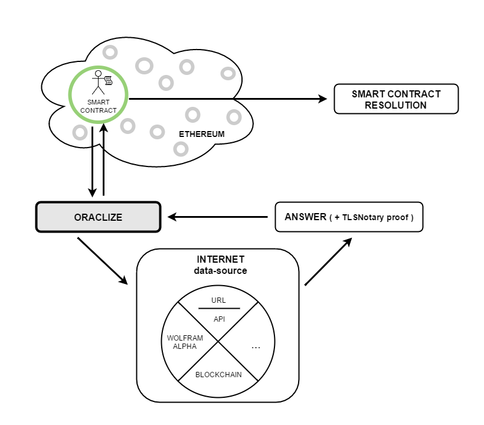
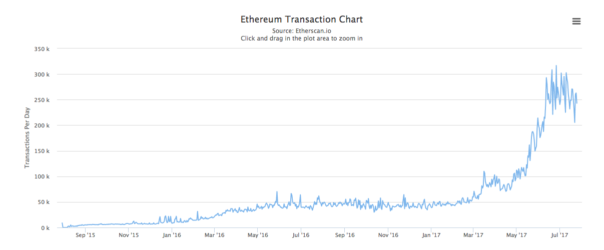

# 區塊鏈技術應用於我國期貨結算交割流程之可行性
## 壹、研究內容重點
分析新加坡Ubin、美國DTCC，等國外相關技術，並列出若將區塊鏈於結算交割流程之可行性。

## 貳、主要發現或結論
### 一、當前技術探討
如同第三章第一節所分析，金融機關主要應用四種區塊鏈概念架構:

* Pre-IPO
* Post-Trade
* Distributed Ledger Technology
* P2P-Trade: OTC市場交易

由於區塊鏈本質即為帳本，因此分散式帳本技術(Distributed Ledger Technology, DLT)應用研究最為廣泛。而目前資料最齊全的相關技術係由新加坡金融管理局(MAS)所發展出來的Ubin。

Ubin的當前研發目標是採雙軌制，也就是除了現行的MEPS+外，另外同時並行分散式帳本技術以達成短期應用目標，並逐步將原有集中式結算系統，替換成以Ubin為基礎架構平台。MAS 相信此技術能帶來下列優點：

* 強化境內結算交割可用性，提升效率與降低信用風險
* 提升對境外交易協作性，待未來技術成熟即可以低成本方式與其餘國家類似技術架接

經過了第一階段的導入後，MAS了解到確實在信用風險以及流動性風險處理有顯著的提升。因為採雙軌制緣故，以及區塊鏈不可逆轉特性，使得保管帳戶(collateral account)更符合金融市場基礎設施準則(PFMI)中之清算最終性及不可撤銷性。此外，在未來甚至可利用Ubin進行發行數位貨幣，當各銀行向中央銀行進行借貸時，不再需要發送現金，降低流動性需求。

此外，現存系統如新加坡MEPS+與我國央行同資系統均為RTGS系統，但MEPS+已採用混合清算(Hybrid Settlement)作業，並具有雙邊及多邊互抵之清算機制，使得未來導入DLT結算機制所受到的阻礙大大降低。

### 二、技術面評估
#### a. 功能性評估
當前清算機制分為:
- 定時淨額清算(Deferred Net Settlement, DNS)
- 即時總額清算(Real-time Gross Settlement, RTGS)
- 混合清算(Hybrid Settlement)
- 款券同步交割(Delivery versus Payment, DVP)

對於期權交易而言，將涉及上述所有機制，其中：
- 保證金存入仰賴銀行端RTGS
- 期中交易時採用混合式清算
- 期末結算時採用DNS清算
- 對於期權合約與保證金交換與計算則需DVP機制
- 實物交割或現金交割亦需DVP機制

若欲從目前DLT技術實作定時淨額清算(DNS)，由於當前區塊鏈帳本技術，如：Gcoin、Ethereum、Hyperledger，等均具備自動帳戶結算、交易紀錄不可更改、不可逆轉、高度資訊安全以及智能合約等特性，完全能運用於DNS情境。由於智能合約特性，可確保交易雙方履行支付義務，降低清算風險。

對於RTGS，由於DLT技術包含逐筆資訊，且演算法特性即具有不可撤銷性，在理想狀況下依然可以完整實作RTGS。惟利用智能合約實作此機制時，需特別處理帳戶融通性問題，以提升流動性。混合清算大致上同RTGS，採中央處理模式以減少流動性需求。

DVP清算為不同資產間之清算，利用智能合約特性配合外部oracle提供資訊可實現不同資產間之交換與清算。由於上一章節提到區塊鏈無法處理非功能性的要求。因此，轉換資產之相關資料須仰賴於外部Oracle程式提供，如下圖：

#### b. 效能評估
考量到區塊鏈與現行技術比較，其中DNS機制相較於其餘機制，較不為效能差異影響，但由於DNS為營業日中指定十點或營業終了後，以整批作業方式計算，區塊鏈技術亦無助DNS面臨之清算風險。

對於RTGS以及混合清算，當前的效能分析如下：

- 根據"期交所資訊系統發展沿革"所示，目前為第四代系統，每秒交易容量可達每秒24,000筆
- 由"Ethereum Transaction Chart"於民國106年7月25號之數據顯示(如下圖)，每日交易量約250,000筆，等同每秒平均4筆交易量

目前仍有相差6000倍的顯著效能差距，而期權交易具有高度效能需求。因此，就現階段而言，區塊鏈尚無法於盤中交易時間提供有效服務。

最後，雖然DVP機制利用智能合約配合外部oracle成功實作。但在期權交易的機制下，智能合約所扮演的角色十分輕微。目前較可行的應用領域僅限於保證金存入與取出，保證金計算。然而，下單後合約交割雖可利用相同方式實作，惟效能要求如同上述盤中交易分析，尚無法達到當前市場需求。

## 參、總結
相較於交易搓合，盤後的結算交割已經是目前區塊鏈技術相對可導入實際運用的領域，但仍舊受限於技術瓶頸、市場特性、與法規限制等因素而無法完全以區塊鏈技術替代現有機制。

但由於近年來區塊鏈市場蓬勃發展，使得各先進國家均陸續進行區塊鏈相關實驗與研究。其餘國家區塊鏈研究的進入點均為交易結算。因此，當前效能雖無法滿足市場快速交易需求，但仍然是對區塊鏈技術應用於期貨相當重要的起始點。

## 肆、備註
1. 以當前Proof-of-work演算法機制而言，新式演算法另有Proof-of-Stake。

## 伍、參考文獻
[1]”Project Ubin SGD on Distributed Ledger”, http://www.mas.gov.sg/~/media/ProjectUbin/Project%20Ubin%20%20SGD%20on%20Distributed%20Ledger.pdf

[2]"支付系統受到網路攻擊之復原方案暨金融市場基礎(PFMI)評估",
http://report.nat.gov.tw/ReportFront/report_detail.jspx?sysId=C10401427

[3]"期交所資訊系統發展沿革", https://www.taifex.com.tw/chinese/1/HistoryOfSystem.asp

[4]"中華民國支付及清算系統", https://www.cbc.gov.tw/public/Attachment/972016463871.pdf

[5]"Understanding oracles", https://blog.oraclize.it/understanding-oracles-99055c9c9f7b

[6]"Ethereum Transaction Chart", https://etherscan.io/chart/tx
